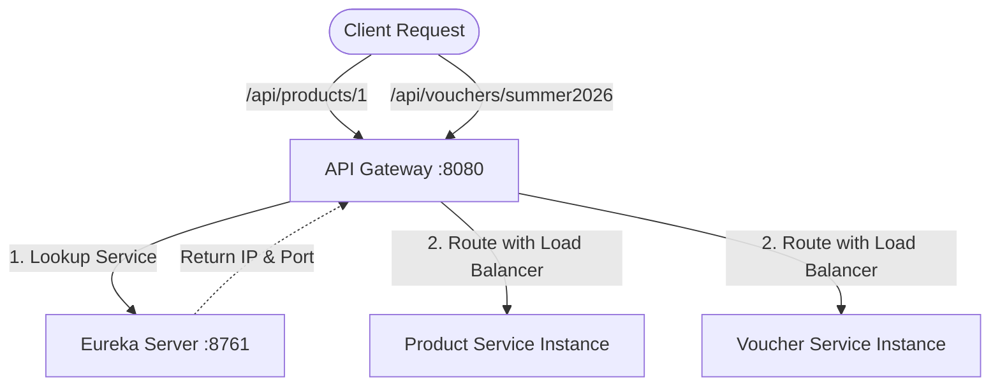

# BÀI TẬP 1: SỬA VÀ BỔ SUNG ROUTE CƠ BẢN CHO API GATEWAY CỦA VIETMART

## 1. Phân tích lỗi `UnknownHostException`

### Nguyên nhân gây ra lỗi:
* Dòng cấu hình gây lỗi: `uri: http://product-service`
* **Giải thích chi tiết:** 
  * Khi cấu hình `uri` bắt đầu bằng giao thức `http://` hoặc `https://`, Spring Cloud Gateway sẽ hiểu đây là một địa chỉ mạng tĩnh (Static URL). Nó sẽ cố gắng thực hiện truy vấn DNS (DNS Lookup) trên hệ thống để phân giải tên miền `product-service` thành địa chỉ IP thực tế.
  * Do `product-service` chỉ là tên ứng dụng được đăng ký nội bộ trong Eureka Service Registry chứ không phải là một domain public hoặc cấu hình trong file `/etc/hosts`, DNS Server cục bộ không thể phân giải được tên miền này và ném ra ngoại lệ `java.net.UnknownHostException`.

### Cơ chế sửa lỗi với Load Balancing (`lb://`):
* Để giải quyết vấn đề này, ta cần sử dụng tiền tố `lb://` (Load Balancer protocol) thay cho `http://`.
* Khi gateway thấy tiền tố `lb://product-service`, thay vì tự phân giải DNS, nó sẽ chuyển tiếp yêu cầu đến **Spring Cloud LoadBalancer** (hoặc thông qua Eureka Client) để tra cứu dịch vụ có tên là `product-service` trong Service Registry.
* Từ danh sách các instance đang hoạt động của `product-service`, Load Balancer sẽ áp dụng thuật toán cân bằng tải (như Round Robin) để chọn một instance phù hợp và định tuyến request tới IP/Port chính xác của instance đó.

---

## 2. Các thay đổi đã thực hiện
1. Sửa đổi cấu hình lỗi của `product-service-route` thành `uri: lb://product-service`.
2. Thêm một route mới `voucher-service-route` sử dụng load balancer `lb://voucher-service` với predicate khớp các request bắt đầu bằng `/api/vouchers/**`.
3. Cấu hình tích hợp đầy đủ với Eureka Server trên cổng mặc định `8761`.

---

## 3. Kiến trúc luồng định tuyến (Routing Flow)
